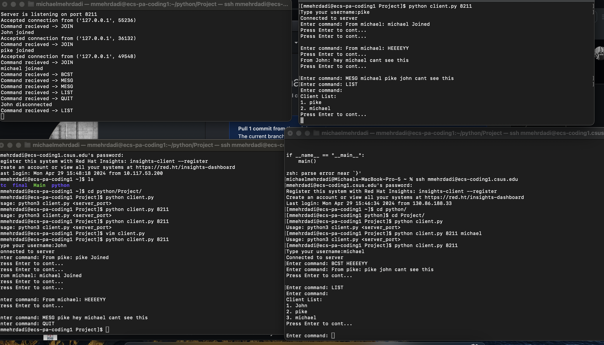

# Devlopers:
    -Michael Mehrdadi (ID: 303314557)
        -Main Deveolper, Tester, Report Writer
        -Created Server and Client component 
    -Brian Hawj (ID: ) 
        -Main Tester

# Simple Chat Server and Client

This repository contains Python scripts for a simple chat server and client implementation using sockets. The server supports basic chat functionalities such as joining, listing clients, sending messages to individual clients, broadcasting messages to all clients, and quitting the chat. The client allows users to connect to the server, join the chat with a username, send messages, and quit the chat. 

## Installation

1. Clone the repository:
   ```
   git clone https://github.com/Puffy12/138-Socket-Project.git
   ```

2. Navigate to the directory:
   ```
   cd 138-Socket-Project
   ```

## Usage

### Server

1. **Running the Server:**
   - Execute the `server.py` script with Python 3 and provide the server port as a command-line argument.
   ```
   python3 server.py <svr_port>
   ```

### Client

1. **Running the Client:**
   - Execute the `client.py` script with Python 3, providing the server port as the first command-line argument.
   ```
   python3 client.py <server_port>
   ```

2. **Client Interaction:**
   - Upon running the client, provide a username when prompted.
   - Enter commands to interact with the chat:
     - To send a message, simply type the message and press Enter.
     - To quit the chat, type `QUIT` and press Enter.

3. **Comands:**
   - `JOIN <username>`: Allows a client to join the chat with a specified username.
   - `LIST`: Lists all currently registered clients.
   - `MESG <receiver_username> <message>`: Sends a message to a specific client.
   - `BCST <message>`: Broadcasts a message to all clients.
   - `QUIT`: Disconnects the client from the server and quits the chat. 

## Usage Example

### Server

```bash
python3 server.py 12345
```

### Client

```bash
python3 client.py 12345
```

1. **Client Interaction:**
   ```
   Type your username: Alice
   Connected to server
   Enter command: JOIN Alice
   User Alice joined
   Enter command: LIST
   Client List:
   1. Alice
   Enter command: BCST Hello everyone!
   From Alice: Hello everyone!
   Enter command: MESG Bob Hello Bob!
   From Alice: Hello Bob!
   Enter command: QUIT
   Alice disconnected
   ```

2. **Server Output:**
   ```
   Server is listening on port 12345
   Accepted connection from ('127.0.0.1', 54564)
   Command received -> JOIN
   Alice joined
   Command received -> LIST
   Command received -> BCST
   Command received -> MESG
   Command received -> QUIT
   Alice disconnected
   ```


## Example: 


## Requirements

- Python 3.x
- Standard Python libraries (no external dependencies)

## About
- This program made use of sockets and threads in python
- Each command and function has comments explaining each section
- This can be easily scaled with a gui or react native interface